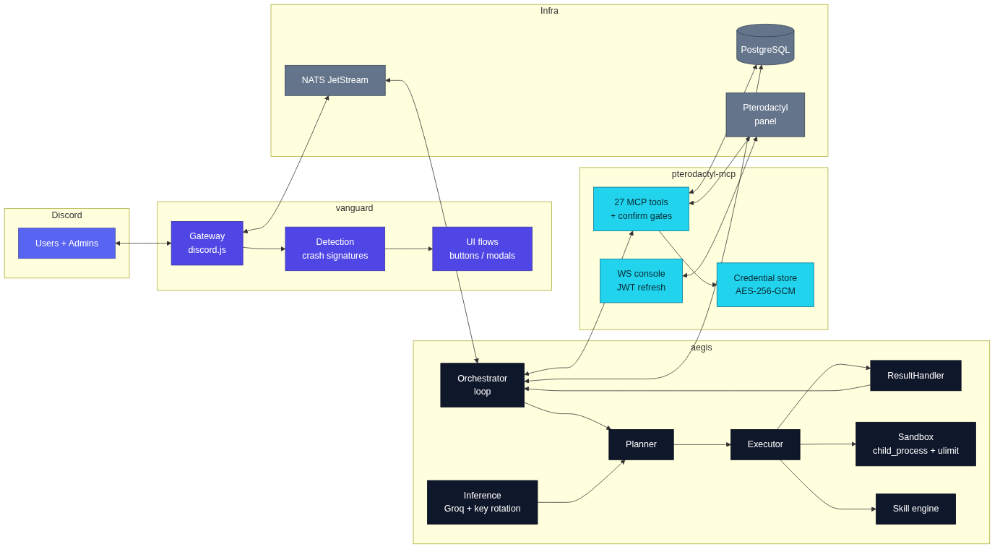
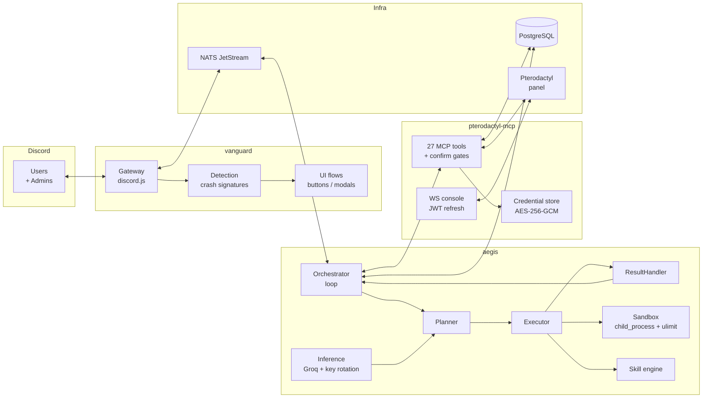

# EdenVanguard

**Autonomous operations agent for Minecraft server hosting — built on Pterodactyl, Discord, and the Model Context Protocol.**

EdenVanguard watches Discord support channels for Minecraft server crashes, diagnoses them with an LLM-driven agent loop, and executes safe remediation against Pterodactyl-managed game servers — with human approval gates on every destructive action.

  



## Why

Game-hosting communities drown in crash reports: players paste logs into Discord, volunteers eyeball them, and the same fixes get re-applied by hand. EdenVanguard turns that flow into an auditable pipeline: **detect → diagnose (LLM) → propose → approve → execute → verify**, with every step stored in PostgreSQL and every privileged operation passing through an MCP safety layer.

## Components

| Workspace | Role | Highlights |
|---|---|---|
| **`vanguard/`** | Discord gateway layer (discord.js 14) | Crash-signature detection (`mclo.gs`, `pastebin`, `bytebin`, inline JVM errors), paste fetchers, slash-command + modal + button flows, NATS publisher/subscriber |
| **`aegis/`** | Autonomous intelligence core | orchestrator → planner → executor → resultHandler → reporter loop, crash diagnostics engine, Groq inference client (round-robin keys, 429-aware retry, AES-256-GCM token decryption), skill engine with dedup + admin review, cron deployment manager (backup → swap → health check → rollback), sandboxed script execution |
| **`pterodactyl-mcp/`** | Standalone MCP server | **27 registered tools** wrapping the Pterodactyl Application + Client APIs (server power, console, files, backups, schedules, build config), WebSocket console with JWT auto-refresh, per-key rate-limit tracking, auto-pagination, `ptla_`/`ptlc_` credential scoping with AES-256-GCM encryption at rest |
| **`shared/`** | Cross-service contracts | IPC envelopes, NATS subjects, type + constant definitions, redaction/validation utilities |

**Hard rule:** Aegis never calls the Pterodactyl REST API directly. Every privileged operation goes through MCP (`Aegis.mcp.invoke("tool_name")`), so safety gates, rate limiting, scoping, and audit live in exactly one place.

## Architecture



## Quickstart

```bash
# 1. Clone and install
git clone https://github.com/x-TheFox/Vanguard.git
cd Vanguard
npm ci

# 2. Configure
cp .env.example .env       # fill in Discord + panel + DB values
# generate the encryption key:
node -e "console.log(require('crypto').randomBytes(32).toString('hex'))"

# 3. Bring up PostgreSQL + NATS (JetStream)
docker compose -f infra/docker/docker-compose.yml up -d

# 4. Apply the database migration (Drizzle)
npm run db:migrate

# 5. Build everything (shared → pterodactyl-mcp → vanguard → aegis)
npm run build

# 6. Register Discord slash commands, then start services
npm run register -w vanguard
npm run start -w pterodactyl-mcp   # MCP server (stdio)
npm run start -w aegis             # intelligence core
npm run start -w vanguard          # Discord gateway
```

## Environment variables

| Variable | Used by | Purpose |
|---|---|---|
| `DISCORD_BOT_TOKEN` | vanguard | Discord bot authentication |
| `DISCORD_CLIENT_ID` | vanguard | Application ID for slash-command registration |
| `ADMIN_DISCORD_IDS` | vanguard/aegis | Comma-separated admin user IDs (approval flows) |
| `PTERO_PANEL_URL` | pterodactyl-mcp | Pterodactyl panel base URL (no trailing slash) |
| `PTERODACTYL_SERVER_ID` | aegis/cron | Default server target for single-server deployments |
| `DATABASE_URL` | aegis, pterodactyl-mcp, vanguard | PostgreSQL connection string |
| `NATS_URL` | vanguard, aegis | NATS JetStream endpoint (`nats://localhost:4222`) |
| `ENCRYPTION_KEY` | aegis, pterodactyl-mcp | 32-byte hex key for AES-256-GCM credential encryption |

LLM keys (Groq) and Pterodactyl tokens (`ptla_`/`ptlc_`) are **not** environment variables at runtime — they live encrypted in the `api_keys` and `ptero_credentials` tables and rotate without restart. See `.env.example` for seeding guidance.

## Scripts (repo root)

| Command | What it does |
|---|---|
| `npm run build` | Emit all workspaces in dependency order |
| `npm run typecheck` | `tsc --noEmit` across all workspaces |
| `npm test` | Unit tests via `node --test` (111 tests, no live services needed) |
| `npm run lint` / `npm run format` | ESLint / Prettier |
| `npm run db:migrate` | Apply the Drizzle migration |
| `npm run docker:up` / `docker:down` | Start/stop PostgreSQL + NATS compose stack |

## Database

PostgreSQL with Drizzle ORM — 10 tables: `api_keys`, `audit_log`, `maintenance_queue`, `suggestion_threads`, `deployment_audit`, `rate_limit_events`, `ptero_credentials`, `skill_registry`, `cron_jobs` (Aegis) + `ptero_credentials` (MCP server). Migration lives in `infra/db/migrations/`.

## Project status

See [STATUS.md](STATUS.md) for the full implemented/not-implemented matrix. Short version: all core subsystems are implemented and unit-tested (111/111 green, typecheck-clean, CI wired). **Not** implemented: container-isolated sandboxing (current sandbox is `child_process` + `ulimit`/timeout hardening), patch-export/rollback tooling (phase 10), integration/e2e suites. Nothing in this repository should be described as production-deployed; it is completed, compile- and test-verified code.

## License / provenance

Consolidated from the original EdenVanguard implementation branch (`Vivian-Adriana/EdenVanguard@feature/initial-implementation`, HEAD `359f751a0de701f9ff085691b0d4c4025ae4a576`) with documented fixes — see commit history and `STATUS.md`.
